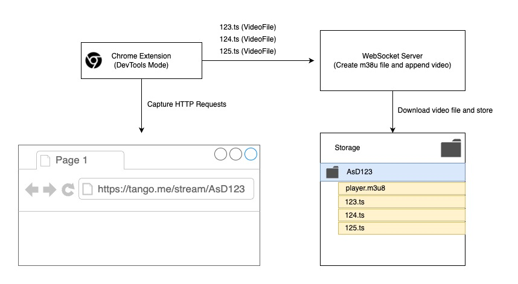

## TangoMe Video Capture & Record

It is a live broadcast that allows you to record live broadcasts from Tango.me to your server.

### How to works

### What is HLS Server?

HTTP live streaming (HLS) is a widely used video streaming protocol that can run on almost any server and is supported by most devices. HLS allows client devices to seamlessly adapt to changing network conditions by raising or lowering the quality of the stream.

### Why did I do this project?
To record live broadcasts without ads or comments and to improve some of my skills.

### How i used?
App (Flutter & Flutter VLC Player.). video_player package does not supports .m3u8 video files.  
URL: [HTTP OR HTTPS]://[IP ADDRESS]/[SAVE DIRECTORY]/[STREAM ID]/player.m3u8  
Example video url : http://192.168.1.1:3131/assets/videos/streamId/player.m3u8

https://github.com/mehmetbeyHZ/tangome-video-recorder/assets/12996462/3af0d4cd-cda3-4d2e-adea-caad74ac8425

